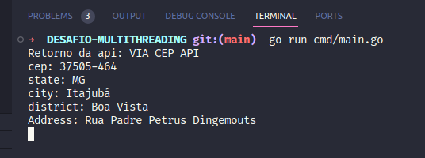

# Desafio Multithreading

1. Para rodar o projeto basta acessar o terminal e digitar o comando:

        go run cmd/main.go

2. Agora basta acessar a url http://localhost:8080?cep=37505-464, um cep deve ser informado no mesmo formato do exemplo da url.

3. Após a consulta será impresso no terminal o sguinte resultado:

Observe na imagem que a api responsável pelo retorno está na primeira linha da impressão

- `VIA CEP API`: https://viacep.com.br/ws/37505-464/json
- `API CEP`: https://cdn.apicep.com/file/apicep/37505-464.json